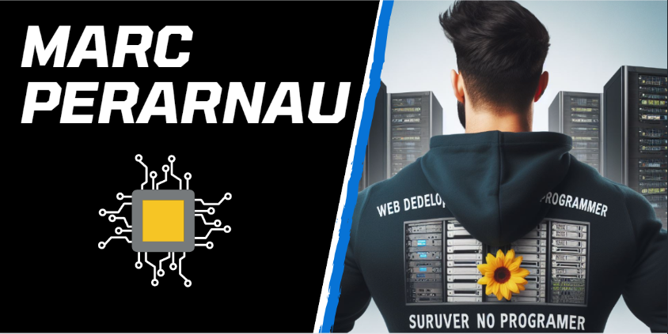

<h1 align='center'>Hi, I'm Marc Perarnau 🖖 </h1>

## 👨‍💻 ABOUT ME

- Web Developer
- Programmer
- ASIR student at IFP 

## 📊 STATISTICS AND 🏆 TROPHIES

&nbsp;

  

## 🌏 CONNECT WITH ME

## 🕸️ WEB DEVELOPMENT

## 🍧 DESIGN TOOLS

## 📅 DATA BASE

## 🎯 PROGRAMMING LANGUAGES

## 🛠️ DEVELOPMENT TOOLS

## 📄 CODE EDITORS & IDES

## 🌐 VIRTUALIZATION

## ⭕ OPERATING SYSTEMS

